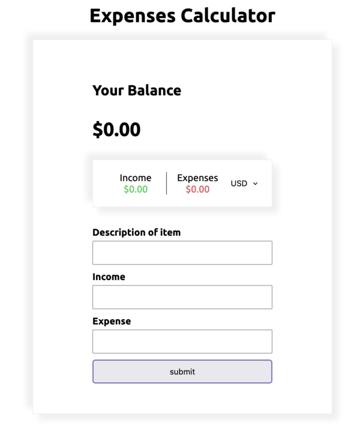

# Expense Calculator

## Welcome! 👋

Thanks for checking out this project.

## The challenge

users should be able to:

- View the optimal layout for the site depending on their device's screen size

## My process

### Built with

- Semantic HTML5 markup
- CSS Flexbox
- CSS Grid
- Vanilla JavaScript

### What I learned
The challenge allowed me to use JS to create a dynamic web content

### Continued development
- Improvement in functional programming
- Improvement in naming variables

## Author
- Made by - "Babajide Ogunlana"
